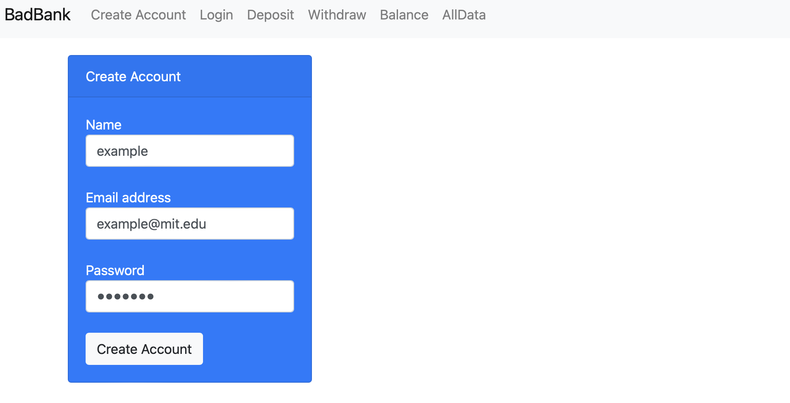
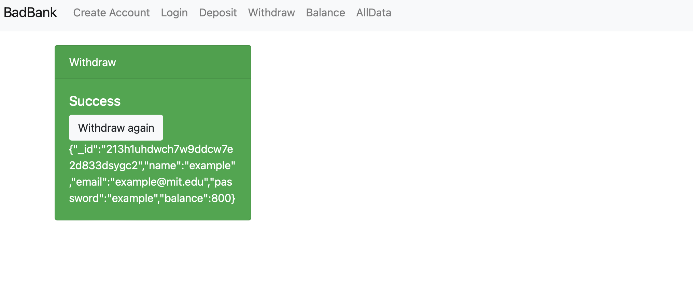

# Project title: Bad Bank Project

## Description/Motivation of Project:
This project allows you to enter a site simulating as if it's a banking portal to create an account, log in and also perform certain actions such as a deposit or withdrawal to the account, in addition to being able to see the balance and see all the information.
The reasons why this project exists are because it's important to show the capabilities for using a full stack development to a real use case, helping users to control their financial information and building this project to achieve the objectives of being an easy to use application, also solving the problem of the lack of a system that integrates all banking functionalities in an intuitive way.
The motivation of the project is to be able to use the development tools seen in the Mit XPro course to have a project with a login/signup method, queries to APIs and a database in MongoDB.

## How to Run - Installation Guidelines:
To run the project locally, follow the next steps:
1. Download the project using git clone syntax.
2. Open the project with your IDE, for example: Visual Studio Code.
3. Install all the libraries using the following command in your IDE terminal (npm install).
4. Install MongoDB service.
5. Start MongoDB service.
6. Install Docker.
7. Start Docker.
8. Run MongoDB inside docker with the following command (docker run -p 27017:27017 --name badbank -d mongo)
9. To run the mongo_test file use the following command (node mongo_test.js)
10. To run the project use the following command (node index.js)
11. To open the project open the following URL with an explorer: localhost:3000.

## How to Stop project:
To stop the project you should type the following command in your IDE terminal: CNTRL + C on Windows or CMD + C on a Mac.

## Screenshots:

## Technology used:
The technology used for this project is the following:
- Javascript as Front-end.
- Node js as Back-end using express.
- MongoDB as the NoSQL Database.
- Docker to have the database running inside a container.

## Features:
The features for this project are the following:
- Signup
- Login
- Deposit
- Withdraw
- Balance
- See all data

Some features to add in the future would be to put withdraw limits per day and an option to deposit to an external bank account with a fee.

## Improvements made:
The improvements made in this project is the MongoDB connection and the different UX/UI style.

## Roadmap of future improvements:
The future improvements to apply in this project is to build more API endpoints.

## License information:
MIT License
Permission is hereby granted, free of charge, to any person obtaining a copy of this software and associated documentation files (the "Software"), to deal in the Software without restriction, including without limitation the rights to use, copy, modify, merge, publish, distribute, sublicense, and/or sell copies of the Software, and to permit persons to whom the Software is furnished to do so, subject to the following conditions:

The above copyright notice and this permission notice shall be included in all copies or substantial portions of the Software.

THE SOFTWARE IS PROVIDED "AS IS", WITHOUT WARRANTY OF ANY KIND, EXPRESS OR IMPLIED, INCLUDING BUT NOT LIMITED TO THE WARRANTIES OF MERCHANTABILITY, FITNESS FOR A PARTICULAR PURPOSE AND NONINFRINGEMENT. IN NO EVENT SHALL THE AUTHORS OR COPYRIGHT HOLDERS BE LIABLE FOR ANY CLAIM, DAMAGES OR OTHER LIABILITY, WHETHER IN AN ACTION OF CONTRACT, TORT OR OTHERWISE, ARISING FROM, OUT OF OR IN CONNECTION WITH THE SOFTWARE OR THE USE OR OTHER DEALINGS IN THE SOFTWARE.
